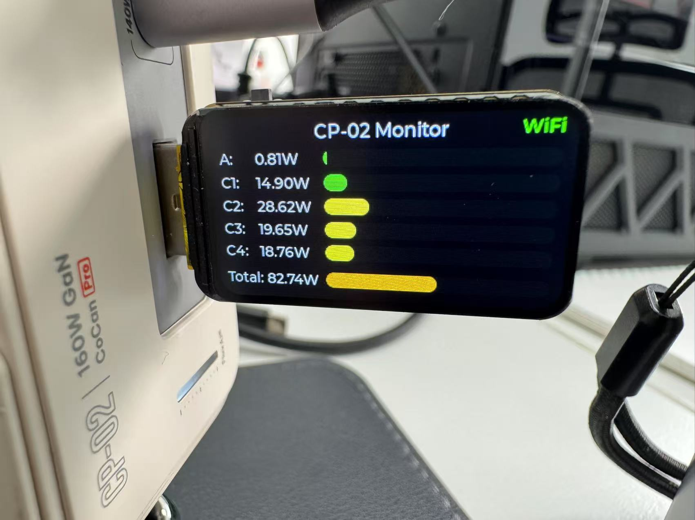
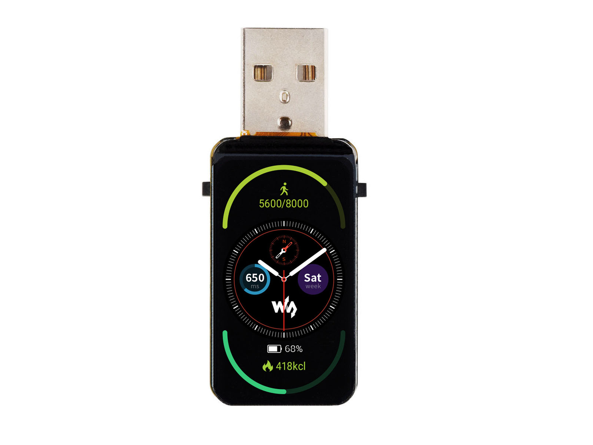
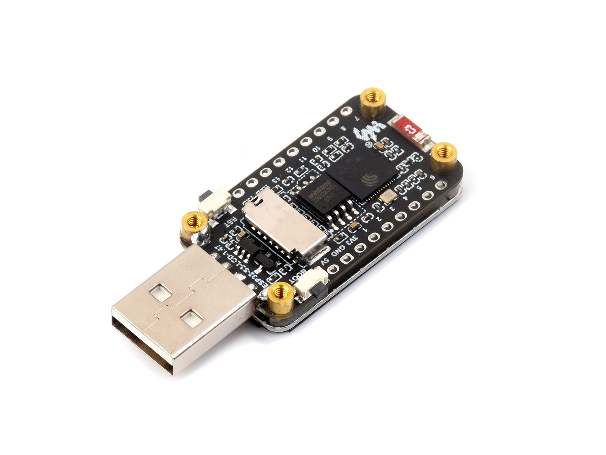
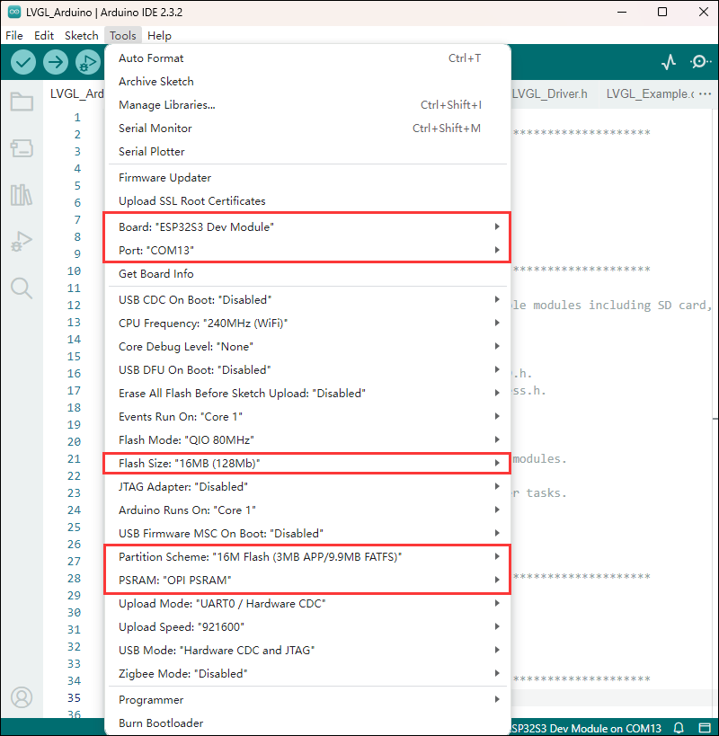
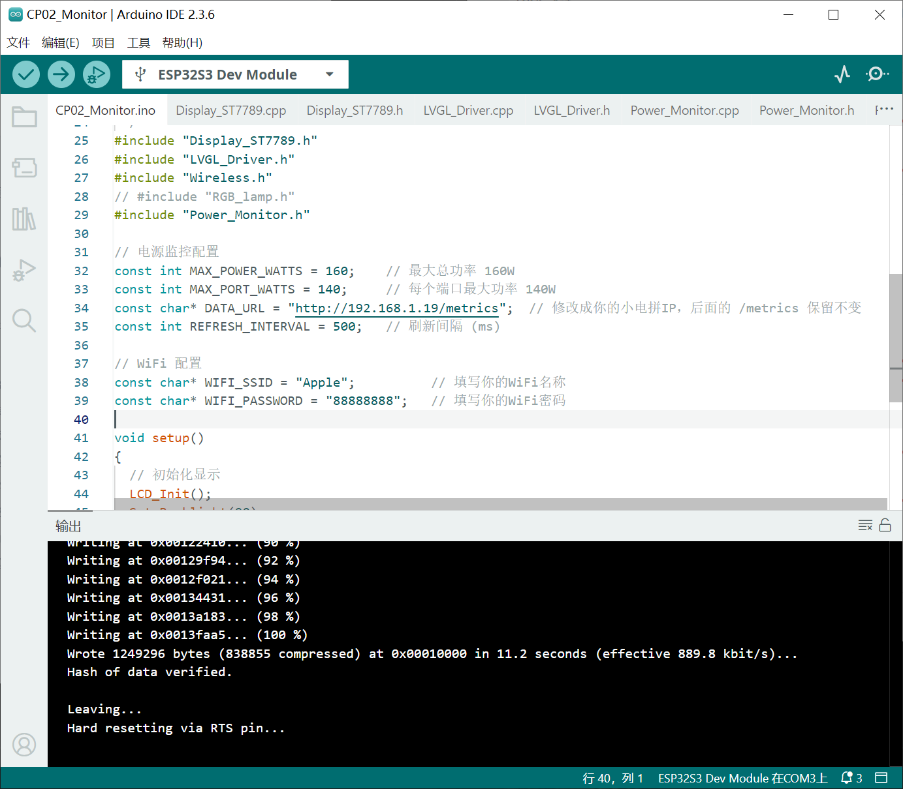

# 小电拼功率监控

实物图：



## 准备工作

首先你需要准备一块 ESP32-S3 带屏开发板：[https://www.waveshare.net/shop/ESP32-S3-LCD-1.47.htm](https://www.waveshare.net/shop/ESP32-S3-LCD-1.47.htm)

如下图：





## 环境配置

环境配置参考文档：

[https://www.waveshare.net/wiki/ESP32-S3-LCD-1.47](https://www.waveshare.net/wiki/ESP32-S3-LCD-1.47)

你需要：

* 安装 Arduino IDE
* 安装 esp32 by Espressif Systems
* 安装 LVGL	图形库

建议先跑通官方的例程，确保环境配置正确。

## 修改 LVGL 以支持浮点数

在 `lv_conf.h` 中，修改如下：

```c
/*Change the built in (v)snprintf functions*/
#define LV_SPRINTF_CUSTOM 1  // 这里改为 1 以支持浮点数输出
#if LV_SPRINTF_CUSTOM
    #define LV_SPRINTF_INCLUDE <stdio.h>
    #define lv_snprintf  snprintf
    #define lv_vsnprintf vsnprintf
#else   /*LV_SPRINTF_CUSTOM*/
    #define LV_SPRINTF_USE_FLOAT 0
#endif  /*LV_SPRINTF_CUSTOM*/
```

在我的电脑上，`lv_conf.h` 在这个位置：

> C:\Users\Administrator\AppData\Local\Arduino15\libraries\lvgl\src\lv_conf.h

## 修改小电拼相关配置

在 `CP02_Monitor.ino` 中，修改如下：

```c
// 电源监控配置
const int MAX_POWER_WATTS = 160;    // 最大总功率 160W
const int MAX_PORT_WATTS = 140;     // 每个端口最大功率 140W
const char* DATA_URL = "http://192.168.1.19/metrics";  // 修改成你的小电拼IP，后面的 /metrics 保留不变
const int REFRESH_INTERVAL = 500;   // 刷新间隔 (ms)

// WiFi 配置
const char* WIFI_SSID = "Apple";          // 填写你的WiFi名称
const char* WIFI_PASSWORD = "88888888";   // 填写你的WiFi密码
```

## 编译运行

使用 Arduino IDE 打开 [CP02_Monitor.ino](CP02_Monitor/CP02_Monitor.ino)，按照官方文档配置好开发板，选择正确的端口，编译上传。

设置开发板：



编译+上传：



